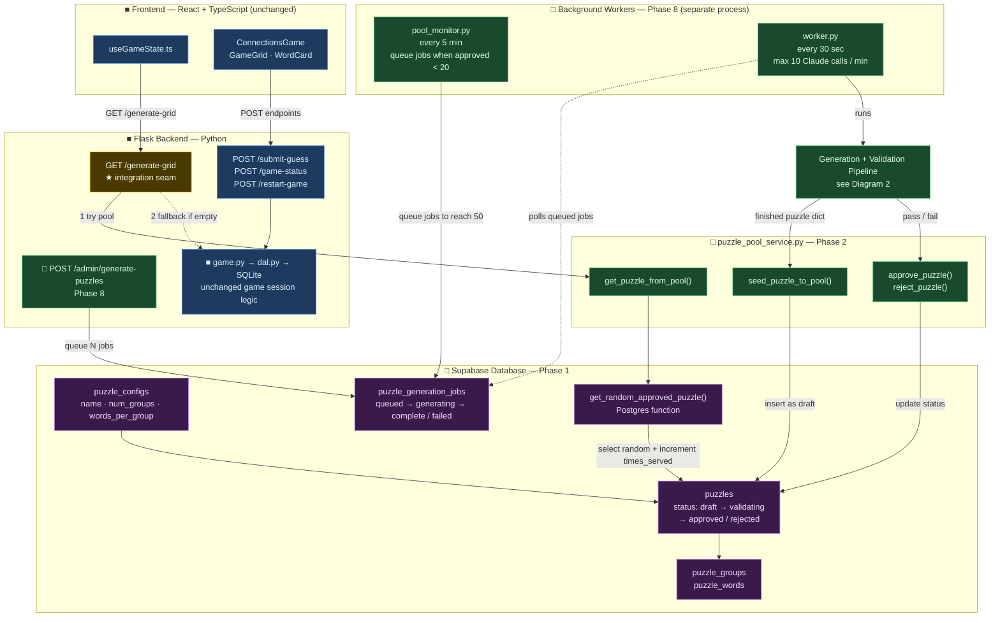

# Puzzle Generation Pipeline — Architecture Diagrams

Visual overview of how the AI puzzle generation pipeline (Phases 1–9) wires into the
existing Connections game stack. See [`connections-puzzle-gen-prompts.md`](../prompts/connections-puzzle-gen-prompts.md)
for the implementation prompts and [`building-llm-powered-connections-puzzles-research.md`](./building-llm-powered-connections-puzzles-research.md)
for the research behind the design.

**Legend:**
- `■` Existing code — unchanged
- `□` New code — added by the pipeline phases
- **Blue** nodes = existing Flask/React code
- **Green** nodes = new Python modules
- **Orange** nodes = Claude API calls (cost money)
- **Purple** nodes = Supabase tables
- **Yellow** node = the single integration seam where old and new connect

---

## Diagram 1 — System Architecture & Serve Path

Shows how the existing frontend and Flask backend connect to the new puzzle pool,
and how background workers keep that pool replenished.

---

## Diagram 2 — Generation & Validation Pipeline

Shows the step-by-step Claude API calls that produce a puzzle and the two-stage
validation gate that determines whether it gets approved into the pool.

```mermaid
flowchart LR
    classDef sonnet fill:#4a2a0a,stroke:#e8832a,color:#fff4e0
    classDef haiku  fill:#1a2e4a,stroke:#72b4e0,color:#e0f0ff
    classDef free   fill:#1a4a2e,stroke:#52c77e,color:#e0ffe0
    classDef result fill:#3a1a4a,stroke:#c084e0,color:#f0e0ff

    subgraph GEN["□ Generation Pipeline — Phases 3 & 4"]
        PG1["① Diversity Seed\nClaude Sonnet · temp=1.0\n4 seed words → creative story\nprevents repetitive themes"]:::sonnet
        PG2["② Category Brainstorm\nClaude Sonnet · temp=0.9\n6-8 themes → select best 4\ndiverse types + full difficulty spread"]:::sonnet
        GG["group_generator.py  Phase 3\n· 8 candidates per group\n· all prior groups as context\n· red herring word required\n· structured JSON output via tool_use\n· 3× retry with exponential backoff"]:::sonnet
        PG3["③ Iterative Group Building\nClaude Sonnet · temp=0.8-1.0\ncalls group_generator per category"]:::sonnet
        PG4["④ Red Herring Refinement\nClaude Sonnet · temp=0.7\nrate overlaps · suggest word swaps\nflag obscure words"]:::sonnet
        PG5["⑤ Final Assembly\npuzzle dict + token metadata"]:::free
        PG1 --> PG2 --> PG3
        PG3 <-->|"per category"| GG
        PG3 --> PG4 --> PG5
    end

    subgraph VAL["□ Validation Pipeline — Phases 5 – 7"]
        VS1["Stage 1 · Structural Checks\nfree · instant\ncounts · no duplicates · distinct names"]:::free
        VS2["Stage 2 · embedding_validator.py  Phase 5\nall-mpnet-base-v2 · no API cost\n· within-group coherence\n  yellow 0.28-0.32 → purple 0.12-0.18\n· between-group distinctiveness  ratio >1.5\n· bridge word detection\n· k-means clustering ARI"]:::free
        VS3["Stage 3 · llm_validator.py  Phase 6\nClaude Haiku · cheap\n· 8 self-consistency solve attempts\n· devil's advocate: find alt groupings\n· difficulty calibration at temp=0"]:::haiku
        VSCORE["Final Score\nembeddings 40% + LLM 60%\npassed = score >0.6\n+ zero auto-fail reasons"]:::free
        VS1 --> VS2
        VS2 -->|"pass"| VS3
        VS2 -->|"auto-fail\nskip LLM"| VSCORE
        VS3 --> VSCORE
    end

    PASS["status → approved\nready to serve instantly"]:::result
    FAIL["status → rejected"]:::result

    PG5 -->|"puzzle dict"| VS1
    VSCORE -->|"pass"| PASS
    VSCORE -->|"fail"| FAIL
```

---

## Key Design Decisions

### The Single Integration Seam
All existing game code — the frontend, Flask routes, game logic, SQLite sessions, animations —
stays **completely unchanged**. The only modification is inside `GET /generate-grid` in
[`backend/src/blueprints/api/routes.py`](../backend/src/blueprints/api/routes.py):
try the pool first, fall back to `connections.json` if the pool is empty.

### Why Two-Stage Validation
Embedding validation (`all-mpnet-base-v2`) runs locally with zero API cost.
Structurally broken puzzles get rejected before spending anything on Claude Haiku.
Only puzzles that pass the free stage burn API tokens — keeping the cost gate efficient.

### Cost Per Approved Puzzle
| Optimization applied | Estimated cost |
|---|---|
| No optimization | ~$0.030 |
| Prompt caching (Phase 9) | ~$0.010–0.015 |
| Prompt caching + Batch API (Phase 9) | ~$0.005–0.008 |

At $0.008/puzzle and a ~40% rejection rate, 500 published puzzles costs under $7 total.

### Serve Latency
Once the pool has approved puzzles, serving one is a **single Postgres function call**
(`get_random_approved_puzzle`) — no Claude API calls, no generation delay.
The background workers keep the pool topped up to 50 puzzles per config at all times.
